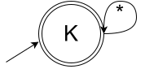
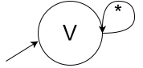

# Lista 1
Aluno: Marcos Vinícius Bandeira Irigoyen

- Diagramas feitos no [draw.io](https://app.diagrams.net/);  
- [Referência pra Q.2](https://www.cs.odu.edu/~toida/nerzic/390teched/regular/fa/acceptor.html).

## Q. 1_

- ### 1) Cadeias de comprimento ímpar;
#### Diagrama  
*considere que há uma seta de estado inicial em P*  

|  | |Descrição formal |
| ---      |---| --- |
| $Q$      |=  | $\{\text{P}, \text{I}\}$ |
| $\sum$   |=  | $\{0,1\}$ |
| $\delta(q, s)$ |=  | $\begin{cases} \text{I} \text{ se } q = \text{P}\\ \text{c.c. } \text{P} \end{cases}$ |
| $q_1$    |=  | $\text{P}$ |
| $F$      |=  | $\{\text{I}\}$ |
- ### 2) Cadeias contendo um número ímpar de 1s;
#### Diagrama  
  
|  | |Descrição formal |
| ---      |---| --- |
| $Q$      |=  | $\{\text{P}, \text{I}\}$ |
| $\sum$   |=  | $\{0,1\}$ |
| $\delta(q, s)$ |=  | Tabela abaixo
| $q_1$    |=  | $\text{P}$ |
| $F$      |=  | $\{\text{I}\}$ |

|Estado| 0 | 1 |
|---   |---|---|
| P    | P | I |
| I    | I | P |
- ### 3) Cadeias começando com 0;
#### Diagrama  
  
|  | |Descrição formal |
| ---      |---| --- |
| $Q$      |=  | $\{\text{D}, \text{N}, \text{C}\}$ |
| $\sum$   |=  | $\{0,1\}$ |
| $\delta(q, s)$ |=  | Tabela abaixo
| $q_1$    |=  | $\text{D}$ |
| $F$      |=  | $\{\text{C}\}$ |

|Estado| 0 | 1 |
|---   |---|---|
| D    | C | N |
| N    | N | N |
| C    | C | C |
- ### 4) Cadeias contendo a subcadeia 010;
  
|  | |Descrição formal |
| ---      |---| --- |
| $Q$      |=  | $\{\text{I}, \text{1c}, \text{2c}, \text{3c}\}$ |
| $\sum$   |=  | $\{0,1\}$ |
| $\delta(q, s)$ |=  | Tabela abaixo
| $q_1$    |=  | $\text{I}$ |
| $F$      |=  | $\{\text{3c}\}$ |

|Estado| 0 | 1 |
|---   |---|---|
| I    | 1c | I |
| 1c   | I | 2c |
| 2c   | 3c | I |
| 3c   | 3c | 3c |
- ### 5) Cadeias que não contenham a subcadeia 010;
*considere que os círculos simples são círculos duplos e vice-versa*  
  
|  | |Descrição formal |
| ---      |---| --- |
| $Q$      |=  | $\{\text{I}, \text{1c}, \text{2c}, \text{3c}\}$ |
| $\sum$   |=  | $\{0,1\}$ |
| $\delta(q, s)$ |=  | Tabela abaixo
| $q_1$    |=  | $\text{I}$ |
| $F$      |=  | $\{\text{I}, \text{1c}, \text{2c}\}$ |

|Estado| 0 | 1 |
|---   |---|---|
| I    | 1c | I |
| 1c   | I | 2c |
| 2c   | 3c | I |
| 3c   | 3c | 3c |
- ### 6) Cadeias que começam e terminam com 0;
  
|  | |Descrição formal |
| ---      |---| --- |
| $Q$      |=  | $\{\text{I}, \text{R}, \text{A}, \text{P}\}$ |
| $\sum$   |=  | $\{0,1\}$ |
| $\delta(q, s)$ |=  | Tabela abaixo
| $q_1$    |=  | $\text{I}$ |
| $F$      |=  | $\{\text{A}\}$ |

|Estado| 0 | 1 |
|---   |---|---|
| I    | R | A |
| R    | R | R |
| A    | A | P |
| P    | A | P |
- ### 7) Cadeias contendo um número par de 0s e um número ímpar de 1s;
  
|  | |Descrição formal |
| ---      |---| --- |
| $Q$      |=  | $\{\text{0P1P}, \text{0P1I}, \text{0I1I}, \text{0I1P}\}$ |
| $\sum$   |=  | $\{0,1\}$ |
| $\delta(q, s)$ |=  | Tabela abaixo
| $q_1$    |=  | $\text{0P1P}$ |
| $F$      |=  | $\{\text{0P1I}\}$ |

|Estado| 0 | 1 |
|---   |---|---|
| 0P1P    | 0I1P | 0P1I |
| 0P1I    | 0I1I | 0P1P |
| 0I1I    | 0P1I | 0I1P |
| 0I1P    | 0P1P | 0I1I |
- ### 8) $\sum^*$
  
|  | |Descrição formal |
| ---      |---| --- |
| $Q$      |=  | $\{\text{K}\}$ |
| $\sum$   |=  | $\{0,1\}$ |
| $\delta(q, s)$ |=  | $K$
| $q_1$    |=  | $\text{K}$ |
| $F$      |=  | $\{\text{K}\}$ |
- ### 9) $\phi$
  
|  | |Descrição formal |
| ---      |---| --- |
| $Q$      |=  | $\{\text{V}\}$ |
| $\sum$   |=  | $\{0,1\}$ |
| $\delta(q, s)$ |=  | $V$
| $q_1$    |=  | $\text{V}$ |
| $F$      |=  | $\{\text{}\}$ |
## Q. 2_

Procurando pegar o caminho direto e, na posição da cadeia que seria o estado, adicionar o fecho de kleene pro alfabeto dos ciclos simples. Quando os ciclos simples passarem por estados com outros ciclos, tem que lidar com o fecho deles também (porque existirão infinitos ciclos além do simples).  
Uma mesma transição para N símbolos é tratada como N arestas entre o par de vértices.

Contando da esquerda pra direita, de cima para baixo:

### AFD 1:  
$\^\delta(q_1, 1) = q_2$ (caminho $q_1 \rightarrow q_2$)  
$\^\delta(q_1, 0) = q_1$ (ciclo $q_1 \rightarrow q_1$)  
$\^\delta(q_2, 1) = q_2$ (ciclo $q_2 \rightarrow q_2$)  
$\^\delta(q_1, (0^i)1\omega) = \^\delta(q_2, \omega)$  

$\^\delta(q_2, 00) = q_2$ (ciclo $q_2 \rightarrow q_3 \rightarrow q_2$)  
$\^\delta(q_2, 01) = q_2$ (ciclo $q_2 \rightarrow q_3 \rightarrow q_2$)  

Linguagem: $L = \{(0^i)1\omega \mid \omega \in \{1,\ 00,\ 01\}^* , i \ge 0\}$  

### AFD 2:
$\^\delta(q_1, 1) = q_2$ (caminho $q_1 \rightarrow q_2$)  
$\^\delta(q_1, 0) = q_1$ (ciclo $q_1 \rightarrow q_1$)  
$\^\delta(q_2, 1) = q_2$ (ciclo $q_2 \rightarrow q_2$)  
$\^\delta(q_2, 01) = q_2$ (ciclo $q_2 \rightarrow q_1 \rightarrow q_2$)  
Linguagem: $L = \{ (0^i)1\omega \mid \omega \in \{1,\ 0(0^j)1\}^* \}$  
ou, diretamente: $L = \{ \omega1 |\omega \in \sum^* \}$

### AFD 3:
$\^\delta(q_1, a) = q_2$ (caminho $q_1 \rightarrow q_2$)  
$\^\delta(q_1, b) = q_1$ (ciclo $q_1 \rightarrow q_1$)  
$\^\delta(q_1, aab) = q_1$ (ciclo $q_1 \rightarrow q_2 \rightarrow q_3 \rightarrow q_1$)  
$\^\delta(q_1, abb) = q_1$ (ciclo $q_1 \rightarrow q_2 \rightarrow q_3 \rightarrow q_1$)  
$\^\delta(q_2, aa) = q_2$ (ciclo $q_2 \rightarrow q_3 \rightarrow q_2$)  
$\^\delta(q_2, ba) = q_2$ (ciclo $q_2 \rightarrow q_3 \rightarrow q_2$)  

Linguagem: $L = \{ \omega a \alpha \mid \omega \in \{b,\ a\beta ab, a\beta bb\}^*,\ \beta \in \{aa,\ ba\}^*, \alpha \in \{aa,\ ba, ab(b^i)a, bb(b^j)a\}^*,\ i,j\ge0 \} $  
simplificando $\omega$ (qualquer cadeia que use $a\beta ab$ ou $a\beta ab$ já iria pra $q_2$):  
Linguagem: $L = \{ (b^i)a\alpha \mid \alpha \in \{aa,\ ba,\ ab(b^i)a,\ bb(b^j)a \}^*,\ i,j\ge0\}$
> **OBS**: Não sei se dá para sempre ignorar ciclos que comecem como o caminho, mas aqui (e na AFD 2 também) funciona

### AFD 4:
Tratando a linguagem de um afd com múltiplos estados finais como a união das linguagens dos afds com um único dos estados finais

$\^\delta(q_1, a) = q_1$ (ciclo $q_1 \rightarrow q_1$)  
$\^\delta(q_1, bbab) = q_1$ (ciclo $q_1 \rightarrow q_2 \rightarrow q_4 \rightarrow q_3 \rightarrow q_1$)  
$\^\delta(q_1, bab) = q_1$ (ciclo $q_1 \rightarrow q_2 \rightarrow q_3 \rightarrow q_1$)  
$\^\delta(q_2, aa) = q_2$ (ciclo $q_2 \rightarrow q_3 \rightarrow q_2$)  
$\^\delta(q_2, baa) = q_2$ (ciclo $q_2 \rightarrow q_4 \rightarrow q_3 \rightarrow q_2$)  
$\^\delta(q_4, b) = q_4$ (ciclo $q_4 \rightarrow q_4$)  

Sub-linguagem: $L_1 = \{\omega \mid \omega \in \{a,\ b(aa)^ibb^ja\alpha b, ba\alpha b\}^*,\ \alpha \in \{aa, abb^ka\}^*,\ i,j,k\ge0\}$ (tentando simplificar com a OBS da afd3)

$\^\delta(q_1, bb) = q_4$ (caminho $q_1 \rightarrow q_2 \rightarrow q_4 $)  

Sub-linguagem: $L_2 = \{a^ib\omega b\alpha \mid \omega \in \{aa,\ aba^jb\}^*,\ \alpha \in \{b,\ a(aa)^kab,\ a(aa)^lba^mb \beta b\}^*,\ \beta \in \{aa, aba^nb\}^*,\ i,j,k,l,m,n\ge0 \}$

Linguagem: $L = \{\omega \mid \omega \in L_1 \cup L_2\}$  