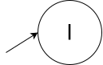
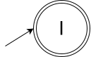

= Lista 4
Aluno: Marcos Vinícius Bandeira Irigoyen
:stem: latexmath
:stylesheet: C:\Users\mvbir\Downloads\boot-slate.css

Imagens e o markup pra lista no https://github.com/Marcos7765/LFA[repositório].

[discrete]
== Q.1_1)
RegEx: stem:[(\Sigma \Sigma)^*]

Escrevi a AFN direto ao invés de separá-la em linguagens 'canônicas' e então operar união e concatenação. (Isso ainda vai acontecer bastante por preguiça de desenhar)

.Diagrama da questão 1.1
image::l4q11.svg[]

.*Descrição formal*
[cols=".^1s, ^.^3", caption=]
|===
|Q| stem:[\{ I,\ Io,\ M,\ F \}]
|stem:[\Sigma]| stem:[\{ a, b, c \}]
|stem:[\delta]| Tabela abaixo.
|q~0~| I
|F| stem:[\{I,F\}]
|===

.*Função de transição*
[cols=".^1s, 4*^.^2", options=header, caption=]
|===
|Estado|a|b|c| stem:[\epsilon]
|I| stem:[\{\}] | stem:[\{\}]| stem:[\{\}]| stem:[\{Io\}]
|Io| stem:[\{M\}]| stem:[\{M\}]| stem:[\{M\}]| stem:[\{\}]
|M| stem:[\{F\}]| stem:[\{F\}]| stem:[\{F\}]| stem:[\{\}]
|F| stem:[\{\}]| stem:[\{\}]| stem:[\{\}]| stem:[\{Io\}]
|===
'''

<<<

[discrete]
== Q.1_2)
RegEx: stem:[1^*(01)^*]

.Diagrama da questão 1.2
image::l4q12.svg[]

.*Descrição formal*
[cols=".^1s, ^.^3", caption=]
|===
|Q| stem:[\{ I,\ Io,\ F,\ I2,\ Io2,\ M2,\ F2 \}]
|stem:[\Sigma]| stem:[\{ a, b, c \}]
|stem:[\delta]| Tabela abaixo.
|q~0~| I
|F| stem:[\{I,F\}]
|===

.*Função de transição*
[cols=".^1s, 3*^.^2", options=header, caption=]
|===
|Estado|0|1| stem:[\epsilon]
|I| stem:[\{\}] | stem:[\{\}]| stem:[\{Io,\ I2\}]
|Io| stem:[\{\}]| stem:[\{F\}]| stem:[\{\}]
|F| stem:[\{\}]| stem:[\{\}]| stem:[\{Io,\ I2\}] 
|I2| stem:[\{\}]| stem:[\{\}]| stem:[\{Io2\}]
|Io2| stem:[\{M2\}]| stem:[\{\}]| stem:[\{\}]
|M2| stem:[\{\}]| stem:[\{F2\}]| stem:[\{\}]
|F2| stem:[\{\}]| stem:[\{\}]| stem:[\{Io2\}]
|===
'''

[discrete]
== Q.1_3)
RegEx: stem:[\phi] + 
alternativamente: stem:[R_1^*\phi R_2^*] +
sendo R~1~ e R~2~ qualquer RegEx para qualquer alfabeto que você quiser.

.Diagrama da questão 1.3

.*Descrição formal*
[cols=".^1s, ^.^3", caption=]
|===
|Q| stem:[\{ I\}]
|stem:[\Sigma]| Qualquer um
|stem:[\delta]| Tabela abaixo.
|q~0~| I
|F| stem:[\{\}]
|===

.*Função de transição*
[cols=".^1s, 4*^.^2", options=header, caption=]
|===
|Estado|v~0~|...|v~n~| stem:[\epsilon]
|I| stem:[\{\}] |...| stem:[\{\}]| stem:[\{\}]
|===
'''

<<<

[discrete]
== Q.1_4)
RegEx: stem:[\phi^*] +
alternativamente: stem:[\epsilon]

.Diagrama da questão 1.4

.*Descrição formal*
[cols=".^1s, ^.^3", caption=]
|===
|Q| stem:[\{ I\}]
|stem:[\Sigma]| Qualquer um
|stem:[\delta]| Tabela abaixo.
|q~0~| I
|F| stem:[\{\}]
|===

.*Função de transição*
[cols=".^1s, 4*^.^2", options=header, caption=]
|===
|Estado|v~0~|...|v~n~| stem:[\epsilon]
|I| stem:[\{\}] |...| stem:[\{\}]| stem:[\{\}]
|===
'''

<<<

[discrete]
== Q.1_5)
RegEx: stem:[(1(0\cup1))^*]

.Diagrama da questão 1.5
image::l4q15.svg[]

.*Descrição formal*
[cols=".^1s, ^.^3", caption=]
|===
|Q| stem:[\{ I_2,\ I_1,\ M,\ F \}]
|stem:[\Sigma]| stem:[\{ 0, 1 \}]
|stem:[\delta]| Tabela abaixo.
|q~0~| I~2~
|F| stem:[\{F\}]
|===

.*Função de transição*
[cols=".^1s, 3*^.^2", options=header, caption=]
|===
|Estado|0|1| stem:[\epsilon]
|I~2~| stem:[\{\}] | stem:[\{\}]| stem:[\{I_1\}]
|I~1~| stem:[\{\}] | stem:[\{M\}]| stem:[\{\}]
|M| stem:[\{F\}]| stem:[\{F\}]| stem:[\{\}]
|F| stem:[\{\}]| stem:[\{\}]| stem:[\{I_1\}]
|===
'''

<<<

[discrete]
== Q.1_6)
RegEx: stem:[\Sigma^*(ab \cup ba)\Sigma^*]

.Diagrama da questão 1.6
image::l4q16.svg[]

.*Descrição formal*
[cols=".^1s, ^.^3", caption=]
|===
|Q| stem:[\{ I_0,\ I_1,\ a,\ b,\ ab,\ ba,\ F \}]
|stem:[\Sigma]| stem:[\{ a, b \}]
|stem:[\delta]| Tabela abaixo.
|q~0~| I~0~
|F| stem:[\{F\}]
|===

.*Função de transição*
[cols=".^1s, 3*^.^2", options=header, caption=]
|===
|Estado|a|b| stem:[\epsilon]
|I~0~| stem:[\{I_0\}] | stem:[\{I_0\}]| stem:[\{I_1\}]
|I~1~| stem:[\{a\}] | stem:[\{b\}]| stem:[\{\}]
|a| stem:[\{\}]| stem:[\{ab\}]| stem:[\{\}]
|b| stem:[\{ba\}]| stem:[\{\}]| stem:[\{\}]
|ab| stem:[\{\}]| stem:[\{\}]| stem:[\{F\}]
|ba| stem:[\{\}] | stem:[\{\}]| stem:[\{F\}]
|F| stem:[\{F\}] | stem:[\{F\}]| stem:[\{\}]
|===
'''

<<<

[discrete]
== Q.1_7)
As reticências aqui serão reticências normais, não estou esculhambando com um estado "..."

RegEx: stem:[(1\cup\epsilon)(01\cup0)^*(1\cup\epsilon)(01\cup0)^*]

A linha vermelha é só para distinguir do resto do diagrama, já que está passando por cima dele.

.Diagrama da questão 1.7
image::l4q17.svg[]

*Nota*: a transição para estrela está inconsistente com a tabela, primeiro achei que estava errado mas não importava neste caso, depois reparei que não importava em caso algum devido à transição com stem:[\epsilon]. Por conta disso, a tabela está 'corrigida' com transições para o estado inicial pré-estrela.

.*Descrição formal*
[cols=".^1s, ^.^3", caption=]
|===
|Q| stem:[\{ I_0,\ 1_0,\ I_2,\ I_1,\ 0_{12},\ 0_{11},\ 1_1,\ I_3,\,\ 1_3,\ ...,\ 1_4 \}]
|stem:[\Sigma]| stem:[\{ 0, 1 \}]
|stem:[\delta]| Tabela abaixo.
|q~0~| I~0~
|F| stem:[\{I_5,\ 1_4,\ 0_{41}\}]
|===

Os outros estados finais que ficaram de fora não vão ter transições de vazio como se seguissem cegamente a sequência (até porque os estados de destino não existiriam), mas não vou botar mais linhas nisso não.

<<<

.*Função de transição*
[cols=".^1s, 3*^.^2", options=header, caption=]
|===
|Estado|0|1| stem:[\epsilon]
|I| stem:[\{\}] | stem:[\{1_0\}]| stem:[\{I_2\}]
|1~0~| stem:[\{\}]| stem:[\{\}]| stem:[\{I_2\}]
|I~2~| stem:[\{\}]| stem:[\{\}]| stem:[\{I_1,\ I_3 \}]
|I~1~| stem:[\{0_{12},\ 0_{11}\}]| stem:[\{\}]| stem:[\{\}]
|0~12~| stem:[\{\}] | stem:[\{1_1\}]| stem:[\{\}]
|0~11~| stem:[\{\}] | stem:[\{\}]| stem:[\{I_1,\ I_3\}]
|1~1~| stem:[\{\}] | stem:[\{\}]| stem:[\{I_1,\ I_3\}]
|I~3~| stem:[\{\}] | stem:[\{1_3\}]| stem:[\{I_5\}]
|1~3~| stem:[\{\}] | stem:[\{\}]| stem:[\{I_5\}]
|...| ... | ...| ...
|1~4~| stem:[\{\}] | stem:[\{\}]| stem:[\{I_4\}]
|===
'''

<<<

[discrete]
== Q.1_8)
RegEx: stem:[(1^* 0 1^*0 1^*0 1^*)^*]

Daqui reparei o descrito na nota da q. anterior.

.Diagrama da questão 1.8
image::l4q18.svg[]

.*Descrição formal*
[cols=".^1s, ^.^3", caption=]
|===
|Q| stem:[\{ I_1,\ I_0,\ 10,\ 20,\ 30 \}]
|stem:[\Sigma]| stem:[\{ 0, 1 \}]
|stem:[\delta]| Tabela abaixo.
|q~0~| I~1~
|F| stem:[\{I_1,\ 30\}]
|===

.*Função de transição*
[cols=".^1s, 3*^.^2", options=header, caption=]
|===
|Estado|0|1| stem:[\epsilon]
|I_1| stem:[\{\}] | stem:[\{\}]| stem:[\{I_0\}]
|I_0| stem:[\{10\}] | stem:[\{I_0\}]| stem:[\{\}]
|10| stem:[\{20\}]| stem:[\{10\}]| stem:[\{\}]
|20| stem:[\{30\}]| stem:[\{20\}]| stem:[\{\}]
|30| stem:[\{\}]| stem:[\{\}]| stem:[\{I_0\}]
|===
'''

<<<

[discrete]
== Q.1_9)
RegEx: stem:[0^*(1\cup \epsilon)(0\cup01)^*1^*]

Considere os estados 1 repetidos como 1~1~ e 1~2~, respectivamente.

.Diagrama da questão 1.9
image::l4q19.svg[]

.*Descrição formal*
[cols=".^1s, ^.^3", caption=]
|===
|Q| stem:[\{ I_1,\ I_2,\ 1_1,\ I_4,\ I_3,\ 0,\ 1_2,\ I_5 \}]
|stem:[\Sigma]| stem:[\{ 0, 1 \}]
|stem:[\delta]| Tabela abaixo.
|q~0~| I~1~
|F| stem:[\{I_5\}]
|===

.*Função de transição*
[cols=".^1s, 3*^.^2", options=header, caption=]
|===
|Estado|0|1| stem:[\epsilon]
|I~1~| stem:[\{I_1\}] | stem:[\{\}]| stem:[\{I_2\}]
|I~2~| stem:[\{\}] | stem:[\{1_1\}]| stem:[\{I_4\}]
|1~1~| stem:[\{\}]| stem:[\{\}]| stem:[\{I_4\}]
|I~4~| stem:[\{\}] | stem:[\{\}]| stem:[\{I_3,\ I_5\}]
|I~3~| stem:[\{0\}] | stem:[\{\}]| stem:[\{\}]
|0| stem:[\{\}]| stem:[\{1_2\}]| stem:[\{I_4,\ I_5 \}]
|1~2~| stem:[\{\}] | stem:[\{\}]| stem:[\{I_4,\ I_5\}]
|I~5~| stem:[\{\}]| stem:[\{I_5\}]| stem:[\{\}]
|===
'''